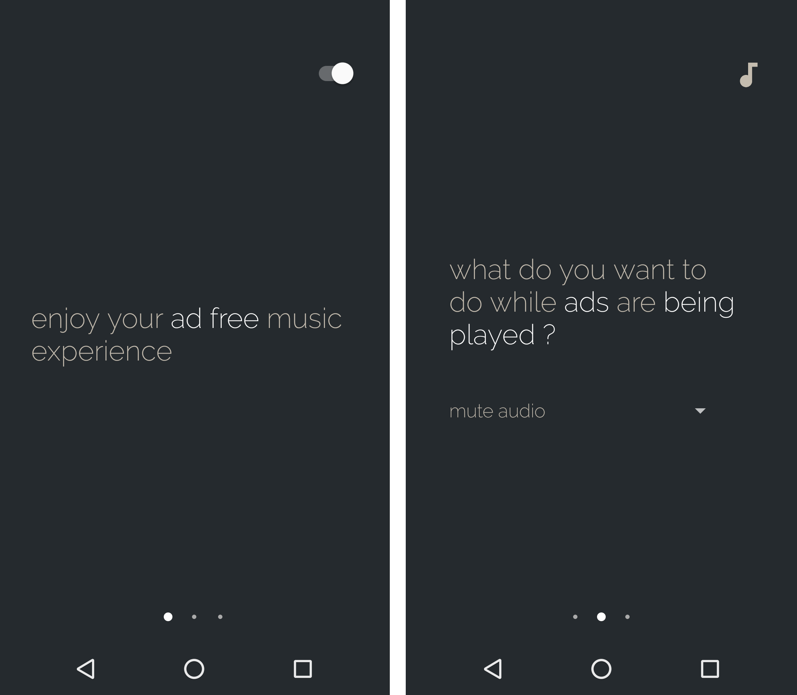

# ad-free
Ad Free is an app for Android that mutes your phone audio whenever there are ads on Spotify.

_Note: Spotify is an awesome company. I recommend you subscribe to Spotify Premium and support their products._  

## Download
Download latest [app-release.apk](https://github.com/abertschi/ad-free/releases/latest) :fire:

## Features
- Turn off sound when advertisement is playing
- Listen to interdimensional cable ads featured in Rick and Morty instead of Spotify ads. Wubalubadubdub!
- No ROOT required
- Update reminder

## Implementation notes
Advertisement detectors are modularized into implementations of [AdDetectable](./app/src/main/java/ch/abertschi/adump/detector/AdDetectable.kt). An instance of `AdDetectable` can determine if a track being played is a Spotify advertisement or not.

In case of ad detection, the music stream is muted. Ads are thus still being played but simply can not be heard.

## Compatibility
Ad Free is currently not compatible with Android TV.

## Release notes

### [v0.0.3.0, 2017-04-23](https://github.com/abertschi/ad-free/releases/tag/v0.0.3.0)
This major release extends the user interface with plugins. Plugins run while ads are being played and
add some level of entertainment to your music experience.

- Listen to interdimensional cable advertisement featured in Rick and Morty instead of casual ads. Wubalubadubdub!

### [v0.0.2.3, 2017-04-20](https://github.com/abertschi/ad-free/releases/tag/v0.0.2.3)
Minor release:
- Sign apk with Signature Scheme v2 and v1

If you update from a previous version to this version, you need to manually uninstall Ad Free on your phone first before you install this version. Starting with this version, Ad Free is signed with the Signature Scheme v2 __and__ V1 to be compatible with more devices.

### [v0.0.2.2, 2017-04-17](https://github.com/abertschi/ad-free/releases/tag/v0.0.2.2)
Minor release
- Fixing issues with Auto Updater

### [v0.0.2, 2017-04-17](https://github.com/abertschi/ad-free/releases/tag/v0.0.2)
- More sophisticated Ad detector implemented.
- Auto update feature available with [AppUpdater](https://github.com/javiersantos/AppUpdater)
- Bug fixing

### [v0.0.1, 2017-04-17](https://github.com/abertschi/ad-free/releases/tag/v0.0.1)
Initial release
- Turns off sound when advertisement is playing
- Adds notification action to filter out false positive matches

## Credits
The bird and website icons used in this app are made by <a href="http://www.freepik.com" title="Freepik">Freepik</a> from <a href="http://www.flaticon.com" title="Flaticon">www.flaticon.com</a> and are licensed by <a href="http://creativecommons.org/licenses/by/3.0/" title="Creative Commons BY 3.0" target="_blank">CC 3.0 BY</a>. Thanks!
