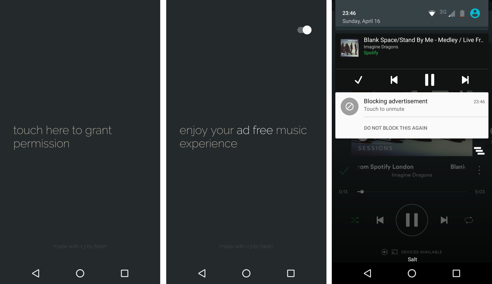

# ad-free
An ad free spotify music experience for Android

## Features
- [x] Turn off sound when advertisement is playing
- [ ] Play local music instead when advertisement is playing
- [x] Check for app updates

## Implementation notes
Advertisement detectors are modularized into implementations of [AdDetectable](./app/src/main/java/ch/abertschi/adump/detector/AdDetectable.kt). An instance of `AdDetectable` can determine if a track being played is a Spotify advertisement or not.

## Release notes
Download latest release [here](https://github.com/abertschi/ad-free/releases/latest)

### [v0.0.2.2, 2017-04-17](https://github.com/abertschi/ad-free/releases/tag/v0.0.2.2)
Minor release
Fixing issues with Auto Updater

### [v0.0.2, 2017-04-17](https://github.com/abertschi/ad-free/releases/tag/v0.0.2)
- More sophisticated Ad detector implemented.
- Auto update feature available with [AppUpdater](https://github.com/javiersantos/AppUpdater)
- Bug fixing

### [v0.0.1, 2017-04-17](https://github.com/abertschi/ad-free/releases/tag/v0.0.1)
Initial release
- Turns off sound when advertisement is playing
- Adds notification action to filter out false positive matches
