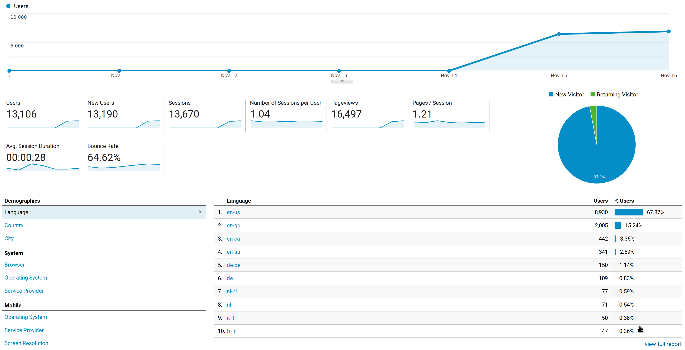

## Comment on interdimensional cable plugin

### 19-11-17
Due to a heavy rise in popularity and uncertainties regarding legal issues the interdimensional
cable plugin is no longer supported.

To keep listening to "Two brothers" and such, download
interdimensional cable on your own and use the local
music plugin to play local audio tracks instead.

During the weekend of 19-11-17, ad-free received much of traffic on its
download page. As I don't track downloads or usage data by design,
traffic on the download site is just a proxy. Nontheless, the rise in
popularity made me decide to discontinue the interdimensional cable
plugin as I do not own the rights to play interdimensional cable tracks.

